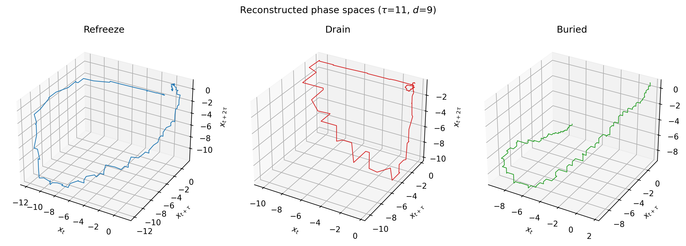
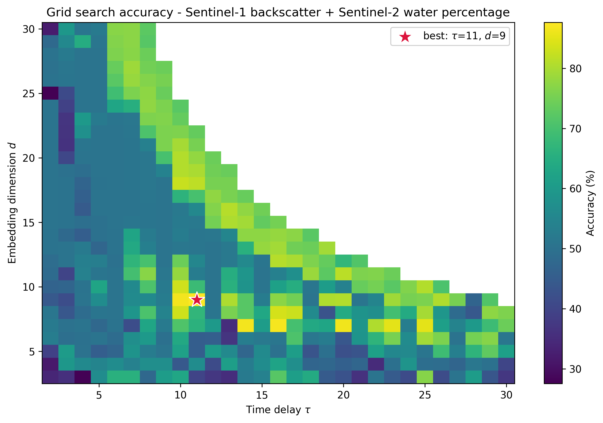

# Time Series Classification of Supraglacial Lakes Evolution over Greenland Ice Sheet

[](https://doi.org/10.1109/ICMLA61862.2024.00072)
[](https://doi.org/10.5281/zenodo.14587026)
[](LICENSE)
[](https://www.python.org/downloads/)

Official implementation of **[Time Series Classification of Supraglacial Lakes
Evolution over Greenland Ice Sheet](https://doi.org/10.1109/ICMLA61862.2024.00072)**,
published at the 2024 International Conference on Machine Learning and
Applications (ICMLA).

Emam Hossain, Md Osman Gani, Devon Dunmire, Aneesh C. Subramanian, Hammad Younas

Canonical repository:
[github.com/ehfahad/TSC-of-Supraglacial-Lakes-Evolution-over-GrIS](https://github.com/ehfahad/TSC-of-Supraglacial-Lakes-Evolution-over-GrIS).
This is the URL cited in the paper. A mirror is maintained by
[iHARP](https://github.com/iharp-institute).

---

## Overview

The Greenland Ice Sheet (GrIS) is a major contributor to global sea level rise.
Supraglacial lakes form on its surface each summer and meet one of three fates,
each with different consequences for ice dynamics and meltwater storage:

| Class | What happens | Signature |
| --- | --- | --- |
| **Refreeze** | Freezes solid at the end of the melt season | Both $HV_{anom}$ and $p_{water}$ fall to zero |
| **Drain** | Empties during the melt season, by overflow or hydrofracture | $p_{water}$ drops sharply mid-season |
| **Buried** | Stays liquid, insulated a few meters below the surface | $p_{water}$ falls to zero but $HV_{anom}$ stays depressed |

**RPS-GMM** classifies these from satellite time series by embedding each lake's
trajectory in a Reconstructed Phase Space (RPS) and fitting one Gaussian Mixture
Model (GMM) per class. A lake is assigned to the class whose GMM gives its
trajectory the highest likelihood.

The method trains on **one representative lake per class**, three trajectories
in total, where the deep learning baselines it is compared against each see
about 622 lakes per fold.

<p align="center">
  <br>
  <em>Each class traces a distinct attractor in phase space. This separation is
  what the per-class GMMs capture.</em>
</p>

### Method

Each lake contributes two daily time series over the melt season:

$$HV_{anom} = HV_{lake} - HV_{background} \qquad p_{water} = \frac{N_{water}}{N_{total}} \times 100\%$$

from Sentinel-1 microwave and Sentinel-2 optical imagery respectively. Under
Takens' embedding theorem a time series maps to state vectors

$$X_n = [x_n,\; x_{n-\tau},\; \ldots,\; x_{n-(d-1)\tau}]$$

with time delay $\tau$ and embedding dimension $d$, both selected by grid search
over $\tau \in [2,30]$, $d \in [3,30]$. One GMM $M_c$ is fitted per class over
its representative trajectory's phase space, and a lake is labeled

$$\hat{a} = \arg\max_c \; p(X \mid M_c)$$

---

## Quickstart

```bash
git clone https://github.com/ehfahad/TSC-of-Supraglacial-Lakes-Evolution-over-GrIS.git rpsgmm
cd rpsgmm

python -m venv .venv && source .venv/bin/activate   # Windows: .venv\Scripts\activate
pip install -e .

# Train on three lakes, evaluate on all 777 (seconds)
python scripts/run_rps_gmm.py --features backscatter_water --tau 11 --d 9
```

The processed data ships with the repository, so this runs with no download.

Conda users: `conda env create -f environment.yml && conda activate rps-gmm`

---

## Repository structure

```
.
├── data/
│   ├── download_data.py           fetch the raw archive from Zenodo
│   ├── raw/                       lake outlines and labels (NetCDF is downloaded)
│   ├── processed/                 per-lake time series used by every experiment
│   └── README.md                  provenance, selection chain, file schemas
├── src/rpsgmm/
│   ├── rps.py                     Takens time-delay embedding
│   ├── model.py                   RPSGMMClassifier, grid search
│   ├── data.py                    dataset loading
│   └── viz.py                     plotting helpers
├── notebooks/
│   ├── 01_preprocessing/          raw satellite data -> processed CSVs
│   ├── 02_rps_gmm/                the two main experiments
│   └── 03_baselines/              sktime ML/DL comparison
├── scripts/
│   ├── run_rps_gmm.py             train and evaluate
│   ├── run_baselines.py           ML/DL baselines
│   ├── build_processed_data.py    rebuild data/processed/ from raw
│   └── make_figures.py            render figures
├── assets/                        images used by this README
└── tests/                         pytest suite
```

---

## Data

777 manually labeled supraglacial lakes (189 refreeze, 392 drain, 196 buried)
across all six GrIS subregions.

Everything needed to run the experiments is in `data/processed/` and tracked in
git. The raw satellite NetCDF is 280 MB and is fetched separately:

```bash
python data/download_data.py            # ~65 MB from Zenodo, checksummed
python scripts/build_processed_data.py --check   # rebuild and verify the CSVs
```

`--check` confirms the processed CSVs regenerate from the raw archive for all
777 lakes. Full provenance, including how 1,000 labeled lakes became the 777
used here, is in [`data/README.md`](data/README.md).

---

## Reproducing the results

### RPS-GMM

```bash
# Full grid search over (tau, d), parallel across cores
python scripts/run_rps_gmm.py --features backscatter --n-jobs -1
python scripts/run_rps_gmm.py --features backscatter_water --n-jobs -1

# Coarse grid, for a quick check
python scripts/run_rps_gmm.py --features backscatter --quick

# A specific embedding, no search
python scripts/run_rps_gmm.py --features backscatter_water --tau 11 --d 9
```

Each run writes `metrics_*.json`, `grid_search_*.csv` and `predictions_*.csv`
into `results/`.

`--n-jobs` changes only the wall time. Every combination is fitted
independently under a fixed `random_state`, so the grid is identical at any
setting. A test enforces this.

Of the 812 pairs in the search space, 464 are usable. A delay vector spans
$(d-1)\tau$ days, so from the 244-day melt-season window only
$L = 244 - (d-1)\tau$ vectors can be formed, and a 10-component GMM needs at
least 10 of them. The remaining combinations cannot be constructed and are
skipped. They form the white region in the grid heat map.

### Baselines

`sktime` pins an older `scikit-learn` than the core pipeline, so give the
baselines their own environment:

```bash
python -m venv .venv-baselines && source .venv-baselines/bin/activate
pip install -e ".[baselines]"

python scripts/run_baselines.py --estimate          # project the runtime first
python scripts/run_baselines.py --features backscatter
python scripts/run_baselines.py --features backscatter_water
```

The four deep models train for 100 epochs across 5 folds; budget a few hours on
CPU, less on a GPU. The nearest-neighbor baseline takes a couple of minutes.

### Figures and tests

```bash
python scripts/make_figures.py
python -m pytest tests -q
```

### Environment

`numpy`, `scipy` and `scikit-learn` are pinned in `requirements.txt`.
`GaussianMixture` depends on k-means initialization, whose behavior has changed
across scikit-learn releases, so pinning keeps runs comparable with each other
and with the checked-in figures.

---

## Results

Results reported in the paper, over all 777 lakes. RPS-GMM is trained on three
lakes; every baseline is evaluated with 5-fold cross-validation, training on
about 622 lakes per fold.

**RPS-GMM** (paper, Figure 4)

| Features | Accuracy | Precision | Recall | F1 |
| --- | :-: | :-: | :-: | :-: |
| $HV_{anom}$ | 85.46% | 85.54% | 85.03% | 85.13% |
| $HV_{anom} + p_{water}$ | **89.70%** | 89.59% | 89.62% | 89.53% |

**Comparison against established models** (paper, Table 1)

| Model | $HV_{anom}$ | $HV_{anom} + p_{water}$ |
| --- | :-: | :-: |
| LSTMFCNClassifier | 84% | 87% |
| FCNClassifier | 51% | 43% |
| ResNetClassifier | 57% | 45% |
| SimpleRNNClassifier | 50% | 49% |
| KNeighborsTimeSeriesClassifier | 80% | 75% |
| **RPS-GMM** (3 training lakes) | **85.46%** | **89.70%** |

Adding the Sentinel-2 water percentage to the Sentinel-1 backscatter improves
accuracy by roughly four points, and RPS-GMM reaches this while training on
three trajectories rather than several hundred.

<p align="center">
  <br>
  <em>Accuracy across the (τ, d) grid for the combined-feature model. The white
  region is where the embedding no longer fits the 244-day window.</em>
</p>

---

## Citation

```bibtex
@inproceedings{hossain2024timeseries,
  author    = {Hossain, Emam and Gani, Md Osman and Dunmire, Devon and
               Subramanian, Aneesh C. and Younas, Hammad},
  title     = {Time Series Classification of Supraglacial Lakes Evolution over
               Greenland Ice Sheet},
  booktitle = {2024 International Conference on Machine Learning and Applications (ICMLA)},
  publisher = {IEEE},
  year      = {2024},
  pages     = {490--497},
  doi       = {10.1109/ICMLA61862.2024.00072}
}
```

Please also cite the dataset:

```bibtex
@dataset{dunmire2025gris,
  author    = {Dunmire, Devon and Subramanian, Aneesh and Hossain, Emam and
               Gani, Md Osman and Banwell, Alison and Younas, Hammad and Myers, Brendan},
  title     = {{Data and Code for: Greenland Ice Sheet wide supraglacial lake
               evolution and dynamics: insights from the 2018 and 2019 melt seasons}},
  year      = {2025},
  publisher = {Zenodo},
  doi       = {10.5281/zenodo.14587026}
}
```

---

## License

Code is licensed under [GPL-3.0](LICENSE). Data is licensed separately under
CC BY 4.0. See [DATA_LICENSE.md](DATA_LICENSE.md) for terms and attribution.

## Acknowledgement

This work is supported by **iHARP: NSF HDR Institute for Harnessing Data and
Model Revolution in the Polar Regions** (Award #2118285). The views expressed in
this work do not necessarily reflect the policies of the NSF, and endorsement by
the Federal Government should not be inferred.
